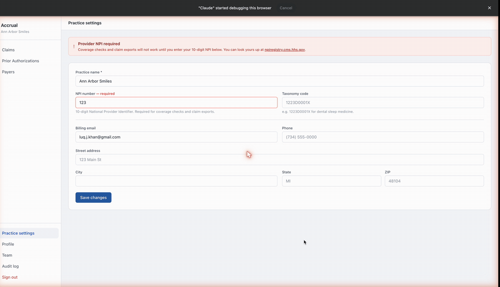

# qa-agent

qa-agent is a Claude Code plugin. It adds a `/qa` command that checks your **running app**
against what you asked to be built, and reports what works, what's broken, what was never
built, and what it couldn't test.



*Above: the agent probing a just-shipped fix on its own. It types an invalid NPI into the
settings form and saves. The old build silently accepted it; the app now rejects it with an
error, so the check comes back verified — no human clicked anything.*

## How it works

When you run `/qa`, it starts a separate verification agent with a clean slate. That agent:

1. Reads what you asked to test — a plain sentence or a ticket — and writes down what "done"
   means, before looking at the app.
2. Opens your running app in your browser and tests each requirement the way a user would.
   If your product has an API, it can test that too.
3. Writes a report that your coding session reads and fixes against. Then you run it again.

The verifier never sees your code, your diff, or your conversation. That's the point: an
agent checking its own work misses the same things twice. A fresh reader catches what the
author can't.

## What you need

- Claude Code (desktop).
- The Claude in Chrome extension, and a running app that **you are logged into**. The agent
  never types passwords — logging in is yours.
- Optional, recommended: Node 18 or newer, for the fast runner (below).

## Install

```
/plugin marketplace add LuqKhan/QA-Agent
/plugin install qa-agent@qa-agent
```

## First run

In your project:

```
/qa "clicking save should clear the reminder banner"
/qa PROJ-1234        # if your team tracks tickets, an ID works too
```

Just describe what you want tested, in your own words. Tickets are optional — if your team
has them, they work too, but a plain sentence is the normal way.

The first run in a project asks three questions — where the app runs, how it gets a
logged-in browser, and whether you use tickets — and offers to save the permissions it needs
so later runs don't keep asking. Say yes to that offer.

Better: run `/qa setup` once right after installing. It does all the onboarding — questions,
permissions, learning your app's pages — in one sitting, so your first real check starts warm.

## Sharing what it learns

The agent saves what it learns about your app (pages, routes, quirks — never expectations,
never credentials) in `.claude/qa/ui-map/` and gets faster every run. Three ways to handle it:

- **Commit the folder** to your project — the whole team shares the learning through the repo.
- **Point it at a shared map repo** — during `/qa setup`, give it any private git repo your
  team owns; the map syncs there instead, and a new teammate's first run starts warm off
  everyone else's learning. Use this when you don't want QA files in the main repo.
- **Gitignore it** — per-person maps, everyone learns separately. Fine for solo use.

## Quick checks

For a single question instead of a whole ticket:

```
/qa quick "does the setup banner disappear once the profile is completed?"
```

## The fast runner (recommended)

Most of a run's time is the model thinking between browser clicks. The runner removes that:
flows the agent has done once are saved as small scripts that re-run in seconds, inside your
real Chrome, with your login. Repeat checks drop from minutes to seconds.

Once per machine:

```bash
# the installed plugin lives under ~/.claude/plugins/cache/qa-agent/qa-agent/<version>/
cd ~/.claude/plugins/cache/qa-agent/qa-agent/*/runner
npm install

# Quit Chrome completely, then relaunch it with:
open -a "Google Chrome" --args --remote-debugging-port=9222
```

That flag lets programs on your machine control that Chrome window. Fine on a dev machine;
skip it anywhere that's not acceptable — everything still works without it, just slower.

## The report

Each run writes a JSON report to `.claude/qa/runs/` and gives you the summary in chat. Every
requirement ends in exactly one state:

- **verified** — the agent watched it work.
- **broken** — with steps to reproduce and what it saw instead.
- **missing** — asked for, never built.
- **untestable** — with the exact reason (say, the behavior takes two days, or dev has no
  outbound email), rather than a guess.

**Missing** is the state that earns this tool its keep: coding agents love saying "done" at
80%. And when the request is too vague to judge against, the agent asks you the question
instead of inventing an answer.

The exact report format is in [examples/findings-example.json](examples/findings-example.json).

## Safety rules

- Only touches test data it created itself (named with a `QA-agent` prefix, fake
  `@example.com` emails).
- Never enters passwords. Never touches billing, user management, or account settings.
- Production is read-only: it asks before saving anything there, and puts back whatever it
  changed before the run ends.

## License

MIT
